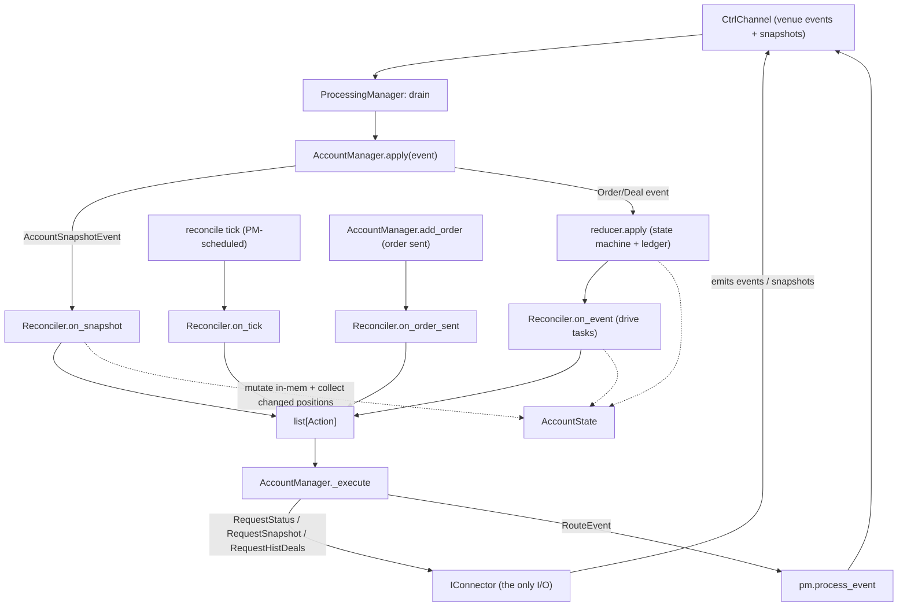
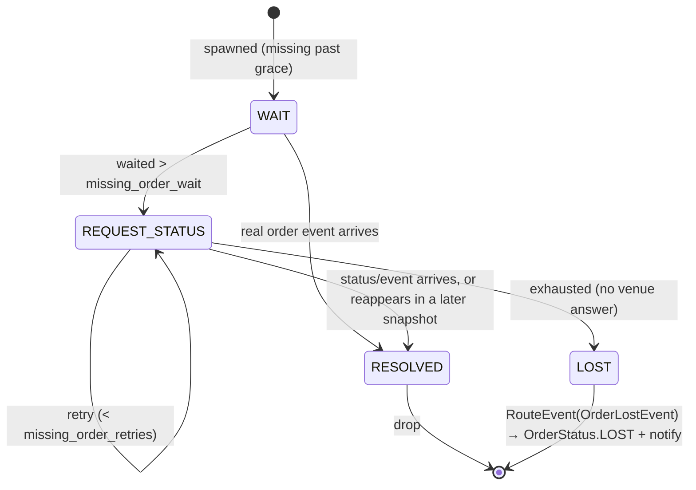
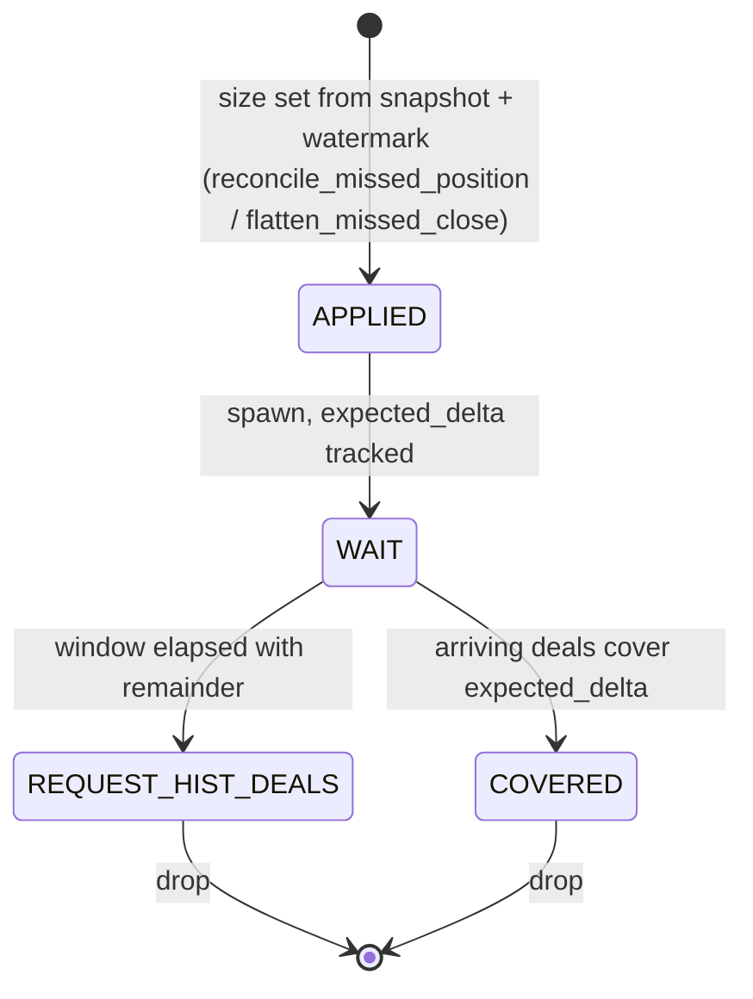
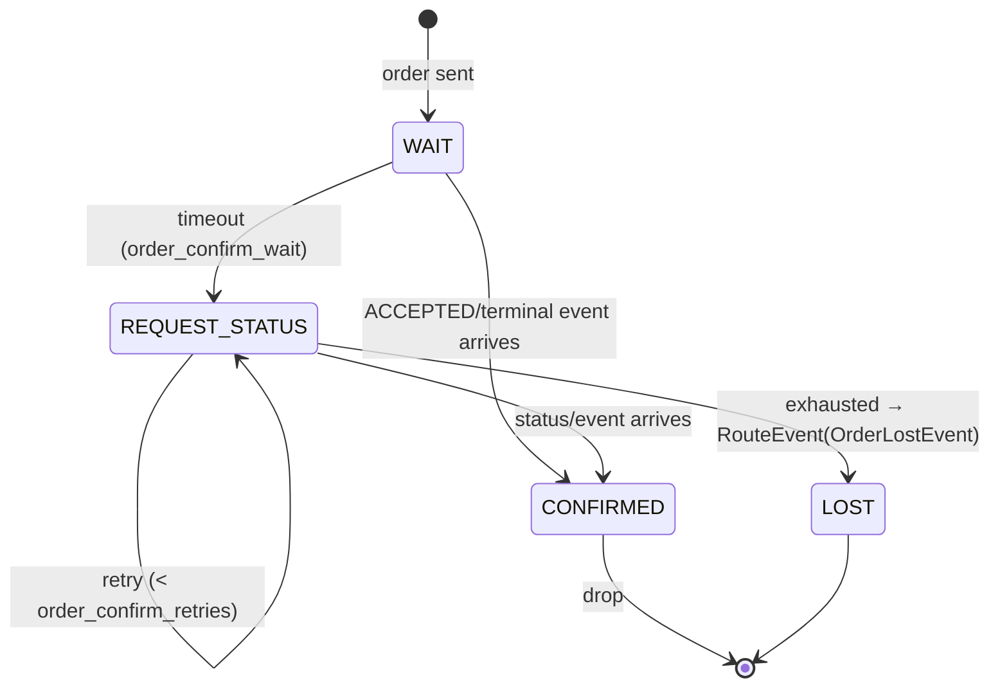

# Reconciliation — Differ + Reconciler

**Status:** implemented and live-validated (Binance.UM micro account, ccxt-smoke).
Merges the former `reconciliator-redesign.md` (stage 1 — the Differ) and
`reconciliation-redesign.md` (stage 2 — the Reconciler) into one document and brings both
up to date with the shipped code.
**Scope:** how qubx keeps local account state in sync with the venue — detecting
discrepancies (stage 1) and resolving them over time (stage 2).
**Companion:** `design.md` (the broader Account-Manager design — order model, state
machine, event model, capital/margin, connectors). This document is the reconciliation
subsystem specifically.
**Code:** `account_manager/diffs.py` (Differ), `account_manager/reconciler.py`
(Reconciler + tasks + actions), `account_manager/reconcile.py` (the `transition`
chokepoint + leaf helpers), `account_manager/manager.py` (the AccountManager driver),
`account_manager/reducer.py` (event application).
**Tests:** `state_diffs_test.py` (Differ matrix), `reconciler_test.py` (mock-free task
scenarios), `reducer_test.py`, `manager_test.py`, plus the ccxt connector read/write tests.

---

## Why

Local (qubx) state and the venue drift apart because of: **lags** (an update not received
yet), **missed events** (venue-side or ours, e.g. a WS gap), **external changes** (manual
UI / another bot), and **position-size calc differences**. Reconciliation periodically
pulls a venue snapshot, diffs it against local state, and resolves the differences.

A difference is rarely certain at first sight — an order "missing" from a snapshot may
just have FILLED in a WS gap — so resolution is **temporal**: wait, retry, then conclude.

The old `reconcile.py::reconcile_snapshot` fused three concerns in one pass (detect what
differs, decide what to do, mutate state), smeared the wait/retry logic across grace
windows + retry counters + manager loops, and carried a covered-quantity *deficit*
accounting that was hard to follow and barely tested. The redesign splits it:

| git analogy | our domain |
|---|---|
| two trees (HEAD vs working tree) | `origin: AccountSnapshot` (venue truth) vs `local: AccountState` |
| `git diff` → list of deltas | `Differ.diff(local, origin)` → `list[Diff]` (stage 1, pure) |
| `git apply` / merge decides | `Reconciler` consumes diffs → `list[Action]` + in-mem mutation (stage 2) |

---

## Architecture



Two roles:

- **`Reconciler` is pure** (`reconciler.py`). Owns the snapshot due-timer, the `Differ`,
  the diff→task mapping, and a small task registry. Every entry point
  (`on_tick` / `on_snapshot` / `on_event` / `on_order_sent`) returns a `list[Action]` and
  may mutate the in-memory `AccountState` it is handed — but **never does I/O**. So every
  live scenario is a mock-free data test.
- **`AccountManager` is the driver** (`manager.py`). It routes events to the right
  per-exchange state, calls the Reconciler, and `_execute`s the returned actions — the
  **only** place connector calls / event routing happen. (This is the role the design docs
  called "AM0"; it was folded into `AccountManager` itself rather than shipped as a
  separate class.)

`reconcile.py` was gutted to its still-shared leaves: `transition` (the validate-then-apply
legality chokepoint), `fill_qty_epsilon`, `liveness_overdue`. The old `reconcile_snapshot`
and the deficit machinery are deleted.

---

## Core invariant — monotonic venue clock

Every applied object — **Order, Position, Balance** — carries its **own venue update
timestamp** (`last_update_time`, venue clock), stamped on **both** sides from venue data.
An incoming update (WS event *or* snapshot leg) is applied only if its venue ts is strictly
newer than what we hold; an equal-or-older update is logged and dropped.

This one rule replaces the old freshness-guard **and** the deficit/suppression accounting:
*last-writer-by-venue-clock wins.* It also covers status safely — a stale event is dropped
whole, so it can't resurrect a terminal order or force an illegal transition.

**Implemented** (was the "venue-timestamp foundation" prerequisite):
- `Order.last_update_time` (new, venue clock) — distinct from the local-clock
  `last_updated_at` eviction key. `Balance.last_update_time` added; `Position` already had it.
- `OrderEvent.last_update_time` carries the WS venue ts; the reducer stamps it (not local `now`).
- ccxt: `ccxt_convert_order_info` reads `lastUpdateTimestamp`/`info.updateTime`;
  `ccxt_convert_position` carries `info["timestamp"]`; `Deal.time` is already venue ms.

**Balances are the weak leg.** Binance futures gives no per-asset snapshot `updateTime`, so
balances can't be strictly venue-clock-guarded from a snapshot. They apply **as-is**, with a
tie-break: skip a currency whose WS-push `as_of` (venue `E`) ≥ the snapshot's `as_of`
(request time). Orders & positions get the real per-object guard.

For positions there is **no WS position push** — size is owned by the deal ledger on the
event path; non-order-driven changes (liquidation/ADL, external trades) surface only at the
next snapshot reconcile, which is the sole size-correction authority.

---

## Stage 1 — the Differ

`diffs.py`. `Differ.diff(local: AccountState, origin: AccountSnapshot) -> list[Diff]`:
a deterministic, **read-only**, clock-free value (modulo one grace gate) — the inspectable
"what differs" that makes every edge case a plain assertion. Raises `ValueError` on an
exchange mismatch.

### Diff taxonomy

```
Diff                                     # base: __repr__ → describe()
├─ LocalOrderMissing(order)              # order local-only        (DELETE; grace-gated)
├─ OriginalOrderMissing(order)           # order snapshot-only      (ADD; no gate)
├─ OrderFieldMismatch(local, origin)     # base for order MODIFY atoms (FIELD marker)
│   ├─ OrderStatusMismatch        FIELD="status"
│   ├─ OrderFilledQtyMismatch     FIELD="filled_quantity"
│   ├─ OrderPriceMismatch         FIELD="price"
│   ├─ OrderVenueIdMismatch       FIELD="venue_order_id"
│   ├─ OrderQuantityMismatch      FIELD="quantity"
│   └─ OrderAvgFillPriceMismatch  FIELD="avg_fill_price"
├─ PositionFieldMismatch(local, origin)  # base for position MODIFY atoms
│   ├─ PositionSizeMismatch       FIELD="quantity"  (rendered "size")
│   ├─ PositionAvgPriceMismatch   FIELD="position_avg_price"
│   └─ PositionMarginMismatch     FIELD="maint_margin"
├─ LocalPositionMissing(position)        # presence; material
├─ OriginalPositionMissing(position)     # presence; material
├─ LocalBalanceMissing(balance)          # presence; material
├─ OriginalBalanceMissing(balance)       # presence; material
├─ BalanceMismatch(local, origin)
└─ VenueFiguresMismatch(local, origin)
```

(The MODIFY bases were renamed from the design-time `DiffOrders` / `DiffPositions` to
`OrderFieldMismatch` / `PositionFieldMismatch`.) Atoms are frozen + slotted + kw-only via
`@diffatom`; `__repr__` → `describe()` renders one git-flavored line so a list of diffs logs
cleanly. Float fields render with `%.8g` (so a `0.001` size isn't shown as `0.00`).

### Grace gate (orders only)

`origin.as_of` is the snapshot **request time** (stamped before the venue fetch). An order
whose local `seen_at` (its `last_update_time`, else `submitted_at`) falls inside
`[as_of − grace, now]` is uncertain relative to the snapshot, so **all** atoms for it are
suppressed (a single `(as_of − seen_at) < grace` comparison; untimestamped → skip). The
gate applies only where there's a local order with a `seen_at`:
`OriginalOrderMissing` (no local seen_at) is never gated; positions/balances/figures have no
grace gate.

### Order matching

1. Index `origin.open_orders` by `venue_order_id` **and** `client_order_id`.
2. For each **non-terminal** local order: match in origin by venue id, else cid; apply the
   grace gate; matched & past grace → per-field MODIFY atoms; unmatched & past grace →
   `LocalOrderMissing`.
3. Each origin order not held locally → `OriginalOrderMissing`.

**"Present locally" spans terminal-retained orders, not just active ones.** A snapshot taken
*before* a fill can still list a since-completed order as open and arrive *after* we
terminalized it locally; matching only active orders would flag it `OriginalOrderMissing` →
recover → re-add an existing cid (crash) / resurrect a terminal order. So the
`OriginalOrderMissing` check uses **all** retained orders (active + terminal). Our terminal
view wins; the stale open copy is ignored. (This was a live-caught race — see the change in
`_diff_orders`.)

### Position / balance presence

Matched by `Instrument` / currency. The snapshot leg being `None` vs a list is load-bearing
(`AccountSnapshot` contract: `None` = *leg not observed*, never "empty"):

- `origin.positions is None` / `origin.balances is None` → leg not observed → silent.
- a **list (incl. empty `[]`)** → observed → an item on only one side is a presence diff.

A **materiality guard** keeps presence quiet for nothings: a position below half a lot is
flat; a balance zero on every leg is nothing. Items present on both sides go through MODIFY.

### Tolerances

quantity/size: `lot_size*0.5`; price/avg: `tick_size*0.5`; margin/balance/figures: relative
`rtol=1e-9`; status/venue_id: exact.

---

## Stage 2 — the Reconciler (task engine)

A generic engine of FSM **tasks**:

- **Identity-agnostic**: a flat `dict[key, task]`. The key is opaque — a cid for order
  tasks, a symbol for position tasks.
- **One task per key** (`_spawn` ignores a duplicate key).
- Events carry **candidate keys** (a deal has a symbol *and* an order id) → routed to any
  task owning one of its keys.

### Entry points

```python
class Reconciler:
    def on_tick(self, state, now) -> list[Action]:        # due-timer → RequestSnapshot, then nudge tasks
    def on_snapshot(self, state, snap, now, *, changed_positions=None) -> list[Action]:
    def on_event(self, state, ev, now) -> list[Action]:   # DealIn / OrderIn → drive tasks by key
    def on_order_sent(self, state, order, now) -> list[Action]:  # spawn AwaitOrderConfirm
```

`on_snapshot`: as_of ratchet (drop a stale snapshot wholesale) → `Differ.diff` → for each
atom, **in its own `try/except`** (one failing atom must not abort the whole reconcile),
either mutate inline or spawn a task. Reconciled positions are collected into
`changed_positions` so the AccountManager fires `on_position_change` per corrected position
(`ApplyResult.positions`). Venue figures are applied after the loop.

### Actions

```python
Action = RequestStatus | RequestSnapshot | RequestHistDeals | RouteEvent | OrderPartiallyFilledEvent

RequestStatus(cid, venue_id, instrument)   # AM → connector.request_order_status
RequestSnapshot(exchange)                  # AM → connector.request_snapshot
RequestHistDeals(instrument, since)        # AM → connector.request_hist_deals (fetch_my_trades)
RouteEvent(event)                          # AM → pm.process_event (synthesized event)
```

The Reconciler injects events (`RouteEvent`) only where there is no venue event to rely on
(give-up LOST, fill-progress notify). Terminalize → LOST is an in-mem mutation, not an action.

### Diff → action mapping (in `on_snapshot`)

| diff atom | handling |
|---|---|
| `LocalOrderMissing` | spawn `ResolveMissingOrder` |
| `OriginalOrderMissing` | `_recover_order` (RECOVERED/EXTERNAL) inline |
| `OrderFieldMismatch` | `_reconcile_order` inline → `RouteEvent(OrderPartiallyFilledEvent)` if changed |
| `PositionSizeMismatch` / `OriginalPositionMissing` | `_reconcile_missed_position` + spawn `ConfirmPositionBySnapshot` |
| `PositionFieldMismatch` | `reconcile_position_from_snapshot` inline (figure refresh) |
| `LocalPositionMissing` | `_flatten_missed_close` + spawn `ConfirmPositionBySnapshot` |
| `BalanceMismatch` / `OriginalBalanceMissing` | `apply_balance_snapshot` inline (push-wins tie-break) |

---

## The tasks / situations

### I. ResolveMissingOrder — local order absent from snapshot

A cached live order is missing from the snapshot. It may have filled/cancelled/rejected
(event not received yet, or missed) — don't blind-cancel.



Resolution comes via the **normal event path** (the real fill/cancel/reject), or the order
**reappearing in a later snapshot** — a snapshot race must not grind a live order to LOST.
Give-up routes `OrderLostEvent` through the bus (the reducer terminalizes to `LOST` and
notifies the strategy) — not a silent mutation, since there's no later WS event to rely on.

### I.b Order field reconcile — present order, fill-progress

A still-open order the snapshot shows more-filled than local (we missed a WS fill). Deals
never move order status, and the missed status update may never arrive, so the snapshot is
authoritative: `_reconcile_order` fixes `status`/`filled_qty` in-mem (venue-ts guarded,
never resurrect a terminal, never wipe a `PENDING_*` marker, `can_transition` force-and-warn)
and routes an `OrderPartiallyFilledEvent` (`fill=None`) so the strategy is notified.

### II. ConfirmPositionBySnapshot — size diff (missed deals)

Snapshot size ≠ local ⇒ we missed deals. The size is corrected from the snapshot
**immediately** (authoritative, stamped with the venue ts and a position-reconcile
watermark); the task then recovers the missed deals **for the record**.



The **watermark** replaces the old deficit math. A deal at/under
`position.last_update_time` is **realize-only**: `update_position_by_deal(..., realize_only=True)`
realizes its r_pnl/commissions but does **not** move size/balance (the snapshot already owns
those) — no double-count. A deal after the watermark is genuinely new and books fully.

`RequestHistDeals(instrument, since=watermark)` → the connector `fetch_my_trades` and emits
each as a **`DealEvent(historical=True)`**. The reducer materializes a recovery deal for an
**untracked** order as a **terminal FILLED** external order (audit record) — *not* an
`ACCEPTED` phantom (which the next snapshot would chase as a missing open order → a
`ResolveMissingOrder` status-fetch loop + warning spam; this was a live-caught bug). It still
books realize-only against the snapshot-owned position.

A flip (missed deals crossed zero) is logged warn-only: recovered r_pnl may be partial since
the close leg is attributed against the already-flipped average.

### LocalPositionMissing → flatten

A material local position absent from an *observed* snapshot is **flattened** (venue
authoritative — `settle_position` zeroes size/market value, **keeps** r_pnl/commissions/
funding), then a `ConfirmPositionBySnapshot` recovers the missed close deals as above.

### III. Balances / figures — no task

Applied inline from the snapshot. Push-wins tie-break: skip a currency whose WS-push `as_of`
≥ the snapshot's `as_of` (the absolute push is at-least-as-fresh). Venue figures
(equity/margins) are set when present; absence keeps the previous capture.

### AwaitOrderConfirm — we sent an order/update

Spawned on `add_order` (`on_order_sent`), keyed by cid.



Replaces the old `_on_inflight_tick` — same engine, as a task.

---

## AccountManager integration

`manager.py` (the driver):

- `apply(event)`: an `AccountSnapshotEvent` is routed to `rec.on_snapshot` (the Reconciler
  owns snapshots end-to-end now; the old `reducer._handle_snapshot` / `reconcile_snapshot`
  path is deleted) and the collected `changed_positions` ride out on `ApplyResult.positions`.
  Other events go through `reducer.apply`; order/deal events additionally drive
  `rec.on_event`.
- `add_order` → `rec.on_order_sent` (spawns `AwaitOrderConfirm`).
- `_execute(state, actions)`: the action executor — `RequestStatus`/`RequestSnapshot`/
  `RequestHistDeals` → connector, `RouteEvent` → `pm.process_event`. Error-isolated per
  action.
- **One reconcile heartbeat** (`_on_reconcile_tick`, at `reconcile_tick_interval_ms`) drives
  `rec.on_tick` (snapshot due-timer + task nudges) and the terminal-eviction sweep —
  replacing the old separate inflight + snapshot ticks. Liveness stays its own tick.
- `ApplyResult.positions` → the PM fires `on_position_change` per reconciled position.

The dead-code sweep removed: `reconcile_snapshot` + snapshot helpers, `ReconcileDiff`, the
snapshot-fill **deficit** mechanism, the state **retry counter**, `_handle_snapshot`,
`_on_inflight_tick`/`_on_snapshot_tick`, and the PM's legacy `reconcile_diff` branch.

### Config (`AccountManagerConfig`)

Per-concept knobs (renamed from the old `inflight_check_*`/`snapshot_check_*`), 1:1 between
the core dataclass and the runner pydantic model, tunable via the `live.account_manager`
YAML block:

| field | default | drives |
|---|---|---|
| `reconcile_tick_interval_ms` | 2000 | reconcile heartbeat cadence |
| `snapshot_interval_ms` | 30000 | snapshot due-timer |
| `snapshot_grace_ms` | 5000 | Differ grace (order missing-from-snapshot) |
| `missing_order_wait_ms` / `missing_order_retries` | 5000 / 5 | `ResolveMissingOrder` |
| `order_confirm_wait_ms` / `order_confirm_retries` | 5000 / 5 | `AwaitOrderConfirm` |
| `position_confirm_wait_ms` | 2000 | `ConfirmPositionBySnapshot` window |
| `liveness_check_interval_ms` / `liveness_check_threshold_ms` | 5000 / 30000 | WS liveness → reconnect |
| `terminal_order_retention_ms` / `terminal_order_history_size` | 30000 / 10000 | terminal eviction |

---

## Testing (mock-free)

Because the Reconciler is pure, a live scenario is a plain data test: build an
`AccountState` + a `Reconciler`, call `on_snapshot` / `on_tick` / `on_event`, assert on
`(resulting state, returned actions, live task keys)`. No connector mocks, no getter/setter
tests — only semantic outcomes (e.g. "a late deal under the watermark realizes r_pnl but
doesn't move size", "a missing order with no answer after n ticks ends LOST", "a historical
deal for an untracked order materializes a terminal order, not an ACCEPTED phantom").

Live validation (ccxt-smoke, Binance.UM micro): order accept/cancel, market + limit fills,
open-order recovery and position recovery on restart, hist-deals recovery, 30s snapshot
reconcile — plus three live-caught bugs fixed (snapshot-vs-fill dup-cid race, historical
phantom-order chase, `QUBX_LOG_LEVEL` ignored without `.env`).

---

## Files

- `account_manager/diffs.py` — `Differ`, `@diffatom`, the atom hierarchy.
- `account_manager/reconciler.py` — `Reconciler`, `Task` ABC, `ResolveMissingOrder` /
  `AwaitOrderConfirm` / `ConfirmPositionBySnapshot`, the `Action` types.
- `account_manager/reconcile.py` — `transition` (legality chokepoint), `fill_qty_epsilon`,
  `liveness_overdue` (everything else was deleted).
- `account_manager/manager.py` — `AccountManager` driver (`apply`, `_execute`, the reconcile
  + liveness ticks).
- `account_manager/reducer.py` — event application; `historical`-deal terminal materialize,
  realize-only watermark booking.
- `account_manager/state.py` — `AccountState` (position-reconcile watermark, venue-ts apply).
- `state_diffs_test.py`, `reconciler_test.py`, `reducer_test.py`, `manager_test.py` — tests.

---

*Visual companion: `reconciliation-redesign.canvas` (Obsidian). The Mermaid diagrams above
are the authoritative "how it works now" rendering.*

