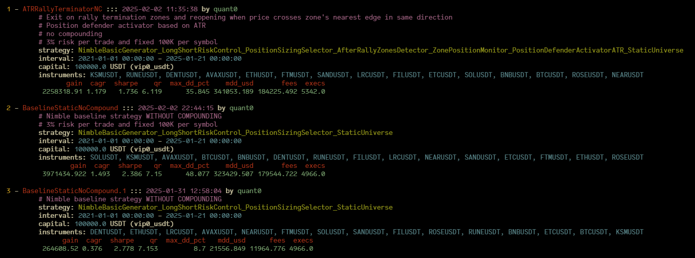
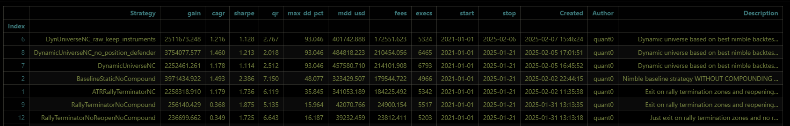

# Backtesting management (from Notebook)

### Storing / restoring simulation results

Result of strategy can be stored into the zip file and reloaded from it when needed.

```python
r = simualte(...)
r[0].to_file("/tmp/MyTest") # -> stores data into /tmp/MyTestxxxxxx.zip, xx - timestamp

# now we can load it from file
r0 = TradingSessionResult.from_file("/tmp/MyTest120250130165123.zip")

# also it's possible to attach some files to result stored to zip
r[0].to_file("/tmp/MyTest", attachments=["config.yaml"]) # -> also adds config.yaml to zip
```

Also it’s possible to generate html report from result

```python
r = simualte(...)
r[0].to_html()
```

It’s possible to use small backtests manager (BacktestsResultsManager)

```python
brm = BacktestsResultsManager("/backtests/")
brm.list() # list supports regexp filters 
```


Then it can load any result by it’s index:

`brm[1]` or `brm[[2, 6, 7]]` etc.

```python
tearsheet(brm[[2, 6, 7]])
tearsheet(brm[1:3)
```

to delete: `brm.delete(1)`

It’s possible to get table
```python
brm.list('.*', as_table=1)
```

