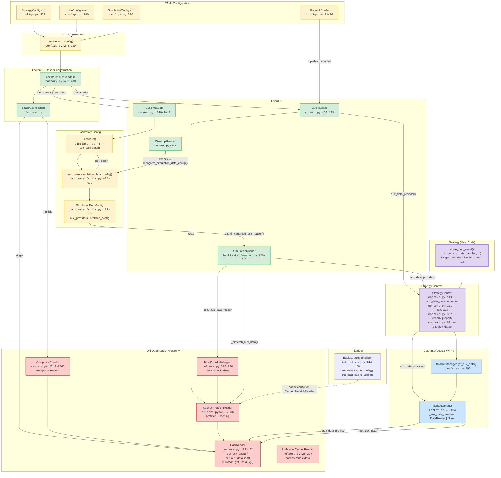
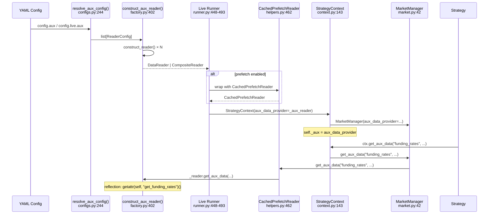
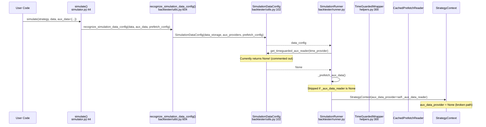
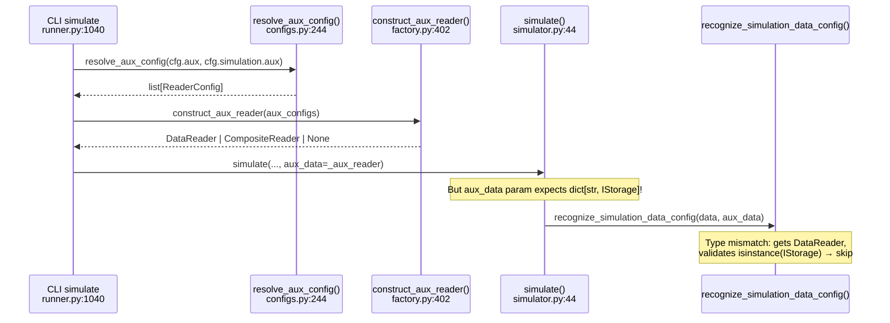
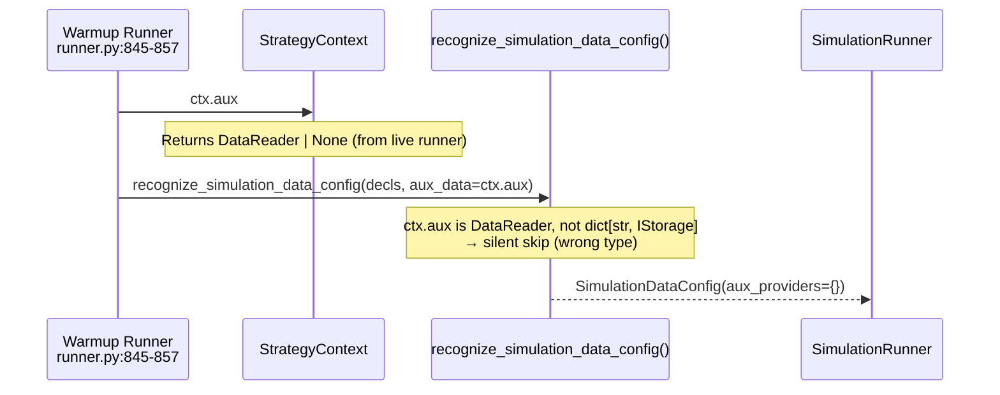

# Aux Data System — Full Architecture Review

## Overview

The aux data system provides **auxiliary data** (funding rates, open interest, fundamental data, etc.)
to strategies via `ctx.get_aux_data(data_id, **kwargs)`. It is **entirely built on the old `DataReader` class**
with reflection-based `get_*()` method discovery — needs migration to `IStorage`/`IReader`.

---

## System Architecture



---

## Detailed Call Chains

### 1. Live Runner Path



### 2. Simulation Runner Path (via `simulate()`)



### 3. CLI Simulate Path (via YAML)



### 4. Warmup Runner Path



---

## File Reference Index

| File | Lines | Role |
|------|-------|------|
| [`configs.py`](../../src/qubx/utils/runner/configs.py) | 91-96, 180, 200, 220, 244-260 | YAML config models, `PrefetchConfig`, `resolve_aux_config()` |
| [`factory.py`](../../src/qubx/utils/runner/factory.py) | 402-438 | `construct_aux_reader()` — builds `DataReader`/`CompositeReader` from config |
| [`runner.py`](../../src/qubx/utils/runner/runner.py) | 258, 448-493, 847, 1040-1043 | Live runner wiring, warmup, CLI simulate |
| [`readers.py`](../../src/qubx/data/readers.py) | 112-162, 2249-2563 | `DataReader` base (reflection dispatch), `CompositeReader` |
| [`helpers.py`](../../src/qubx/data/helpers.py) | 25-297, 300-340, 462-2066 | `InMemoryCachedReader`, `TimeGuardedWrapper`, `CachedPrefetchReader` |
| [`interfaces.py`](../../src/qubx/core/interfaces.py) | 893, 2430-2451 | `IMarketManager.get_aux_data()`, `IStrategyInitializer.set_data_cache_config()` |
| [`market.py`](../../src/qubx/core/mixins/market.py) | 28-134 | `MarketManager._aux_data_provider: DataReader \| None` |
| [`context.py`](../../src/qubx/core/context.py) | 143, 181, 332, 631 | `StrategyContext._aux`, `ctx.aux`, `ctx.get_aux_data()` |
| [`backtester/utils.py`](../../src/qubx/backtester/utils.py) | 102-140, 604-638 | `SimulationDataConfig`, `recognize_simulation_data_config()` |
| [`backtester/runner.py`](../../src/qubx/backtester/runner.py) | 126, 391, 466, 575-612 | `SimulationRunner._aux_data_reader`, `_prefetch_aux_data()` |
| [`simulator.py`](../../src/qubx/backtester/simulator.py) | 44, 107 | `simulate(aux_data=...)` entry point |
| [`initializer.py`](../../src/qubx/core/initializer.py) | 144-168 | `BasicStrategyInitializer.set_data_cache_config()` |

---

## Key Problems

### 1. Type Mismatch — simulation vs live
- **Live runner** (`runner.py:493`): passes `DataReader` as `aux_data_provider` → works
- **CLI simulate** (`runner.py:1043`): passes `DataReader` as `aux_data` param to `simulate()` which expects `dict[str, IStorage] | None` → **type mismatch**, silently ignored in `recognize_simulation_data_config()`
- **Warmup** (`runner.py:847`): passes `ctx.aux` (a `DataReader`) as `aux_data` → same type mismatch → silently ignored

### 2. `get_timeguarded_aux_reader()` is Dead Code
- `SimulationDataConfig.get_timeguarded_aux_reader()` (`backtester/utils.py:117`) — **entirely commented out**, always returns `None`
- This means `SimulationRunner._aux_data_reader` is always `None` in simulation
- `_prefetch_aux_data()` always early-returns

### 3. Reflection-Based Dispatch
- `DataReader.get_aux_data()` uses `hasattr(self, f"get_{data_id}")` → fragile, no type safety
- `get_aux_data_ids()` scans class methods via `__dict__` → breaks with inheritance, dynamic methods

### 4. Deep Wrapper Nesting
- Live path can stack: `TimeGuardedWrapper(CachedPrefetchReader(CompositeReader([DR, DR, ...])))`
- `_prefetch_aux_data()` manually unwraps `isinstance` chains (`runner.py:581-584`)

### 5. Dual System — IStorage vs DataReader
- New data path uses `IStorage` → `IReader.read()`
- Aux data still entirely on old `DataReader.get_aux_data()` with `get_*()` reflection
- No bridge between the two systems

---

## Old DataReader Hierarchy (to refactor)

```mermaid
classDiagram
    class DataReader {
        +get_aux_data(data_id, **kwargs) Any
        +get_aux_data_ids() set~str~
        +read(data_id, start, stop, ...) list
        +get_names() list~str~
        +get_symbols(exchange, dtype) list~str~
        #reflection: get_{data_id}(**kwargs)
    }

    class InMemoryDataFrameReader {
        +read()
    }

    class InMemoryCachedReader {
        -_reader: DataReader
        -_external: dict
        +get_aux_data(data_id, **kwargs)
        +get_aux_data_ids()
    }

    class TimeGuardedWrapper {
        -_reader: DataReader
        -_time_guard_provider: ITimeProvider
        +read(data_id, ...)
        +get_aux_data(data_id, **kwargs)
        -_time_guarded_data(data)
    }

    class CachedPrefetchReader {
        -_reader: DataReader
        -_aux_cache: dict
        -_read_cache: dict
        +read(data_id, ...)
        +get_aux_data(data_id, **kwargs)
        +get_aux_data_ids()
        +prefetch_aux_data(names, ...)
        -_fetch_and_cache_aux_data()
        -_filter_aux_data_to_requested_range()
        -_merge_aux_data()
        -_detect_aux_data_overlap()
    }

    class CompositeReader {
        -readers: list~DataReader~
        +get_aux_data(data_id, **kwargs)
        +get_aux_data_ids()
        +read(data_id, ...)
        -_merge_aux_data()
    }

    DataReader <|-- InMemoryDataFrameReader
    InMemoryDataFrameReader <|-- InMemoryCachedReader
    DataReader <|-- TimeGuardedWrapper
    DataReader <|-- CachedPrefetchReader
    DataReader <|-- CompositeReader

    TimeGuardedWrapper o-- DataReader : wraps
    CachedPrefetchReader o-- DataReader : wraps
    CompositeReader o-- DataReader : wraps N
    InMemoryCachedReader o-- DataReader : wraps
```

---

## Summary: What Touches Aux Data

| Component | Type | Status | Notes |
|-----------|------|--------|-------|
| `StrategyConfig.aux` | Config | ✅ Active | YAML-level config |
| `LiveConfig.aux` | Config | ✅ Active | Section override |
| `SimulationConfig.aux` | Config | ✅ Active | Section override |
| `resolve_aux_config()` | Config util | ✅ Active | Merges global/section |
| `construct_aux_reader()` | Factory | ✅ Active | Builds DataReader hierarchy |
| `DataReader.get_aux_data()` | Base | ✅ Active | Reflection dispatch |
| `CompositeReader` | Wrapper | ✅ Active | Multi-reader merge |
| `CachedPrefetchReader` | Wrapper | ✅ Active | Caching + prefetch |
| `TimeGuardedWrapper` | Wrapper | ✅ Active (live only) | Look-ahead prevention |
| `InMemoryCachedReader` | Wrapper | ✅ Active | In-memory candle cache |
| `MarketManager._aux_data_provider` | Core | ✅ Active | Stores DataReader |
| `StrategyContext._aux` / `ctx.aux` | Core | ✅ Active | Stores & exposes DataReader |
| `ctx.get_aux_data()` | Core | ✅ Active | Strategy-facing API |
| `IMarketManager.get_aux_data()` | Interface | ✅ Active | Abstract interface |
| `IStrategyInitializer.set_data_cache_config()` | Interface | ⚠️ Partial | Config only, not wired to runtime |
| `SimulationDataConfig.get_timeguarded_aux_reader()` | Backtester | ❌ Dead | Commented out, returns None |
| `SimulationRunner._prefetch_aux_data()` | Backtester | ❌ Dead | Always skipped (reader=None) |
| `simulate(aux_data=...)` | Entry point | ⚠️ Broken | Expects `dict[str, IStorage]`, gets `DataReader` from CLI |
| Warmup runner `ctx.aux` pass-through | Runner | ⚠️ Broken | Type mismatch: DataReader → IStorage check fails |
